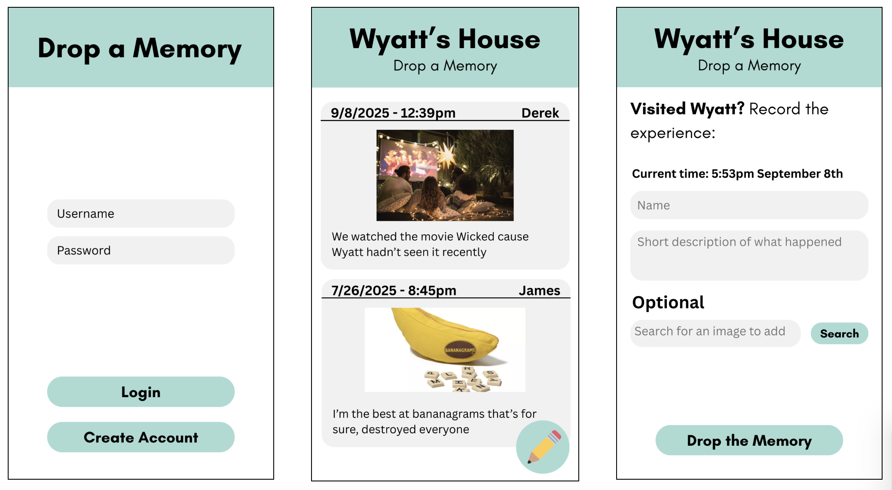

# Your startup name here

[My Notes](notes.md)

A brief description of the application here. I'm going to make a really cool startup, I'm just not quite sure yet what that is going to be yet.

> [!NOTE]
> If you are not familiar with Markdown then you should review the [documentation](https://docs.github.com/en/get-started/writing-on-github/getting-started-with-writing-and-formatting-on-github/basic-writing-and-formatting-syntax) before continuing.

## 🚀 Specification Deliverable

> [!NOTE] For this deliverable I did the following. I checked the box `[x]` and added a description for things I completed.

-   [x] Proper use of Markdown
-   [x] A concise and compelling elevator pitch
-   [x] Description of key features
-   [x] Description of how you will use each technology
-   [x] One or more rough sketches of your application. Images must be embedded in this file using Markdown image references.

### Elevator pitch

It's important to remember. Remember past experiences, past conversations, past friends. Yet despite this, in our hustle and bustle, in our busy daily lives, we often don't have the time or don't make the effort to record these small, important moments. But our homes can show small snapshots of our lives. That's where Drop A Memory comes in. Home owners post a QR code or url in their home, which links to their personal Drop A Memory room. Visitors take 30 seconds to visit the website to leave a small description of their activities (to drop a memory), creating a living record of all the visitos, memories and experiences in the home.

### Design

1. Login page (on the left)
2. Main page with memories
3. Memory submission page

### Key features

-   Create an account to start your personal room as the admin
-   Login to your personal account through HTTPS
-   Ability for admin to delete specific memories
-   Access any user's room with their personal url
-   View all memories left by past visitors
-   Add new memories which are stored in a database
-   See memories update in real time

### Technologies

I am going to use the required technologies in the following ways.

-   **HTML** - I will use HTML to create the structure of the application. It will have 3 main pages, one for login, one for viewing memories, and one for adding a memory.
-   **CSS** - I will use CSS to style the application and make it mobile and desktop friendly, with a modern responsive design.
-   **React** - I will use React to add responsive functionality and to handle the website routing. I will use it to submit API requests and automatically hot-refresh the screen when new information is received. I will use React Router to direct users from page to page, and route parameters to bring users to a specific room without having to login.
-   **Service** - Backend service that includes endpoints to:
    -   `create account` - which creates a new room.
    -   `login` - which routes a user to their personal room and sets them as an admin.
    -   `add memory` - which adds a new memory to the database.
    -   `remove memory` - which removes an existing memory from the database.
    -   `retrieve image` - which calls UnsplashAPI to help users search and select a stock image that represents the memory being described.
-   **DB/Login** - The database would likely have two tables - one for users and one for memories. Each memory row would store a timestamp, name, description, optionally a photo url, and the username to link the memory to the correct room.
-   **WebSocket** - I will use WebSockets so that all users connected can instantly see changes made to the database, including memories added or memories removed.

## 🚀 AWS deliverable

For this deliverable I did the following. I checked the box `[x]` and added a description for things I completed.

-   [ ] **Server deployed and accessible with custom domain name** - [My server link](https://yourdomainnamehere.click).

## 🚀 HTML deliverable

For this deliverable I did the following. I checked the box `[x]` and added a description for things I completed.

-   [ ] **HTML pages** - I did not complete this part of the deliverable.
-   [ ] **Proper HTML element usage** - I did not complete this part of the deliverable.
-   [ ] **Links** - I did not complete this part of the deliverable.
-   [ ] **Text** - I did not complete this part of the deliverable.
-   [ ] **3rd party API placeholder** - I did not complete this part of the deliverable.
-   [ ] **Images** - I did not complete this part of the deliverable.
-   [ ] **Login placeholder** - I did not complete this part of the deliverable.
-   [ ] **DB data placeholder** - I did not complete this part of the deliverable.
-   [ ] **WebSocket placeholder** - I did not complete this part of the deliverable.

## 🚀 CSS deliverable

For this deliverable I did the following. I checked the box `[x]` and added a description for things I completed.

-   [ ] **Header, footer, and main content body** - I did not complete this part of the deliverable.
-   [ ] **Navigation elements** - I did not complete this part of the deliverable.
-   [ ] **Responsive to window resizing** - I did not complete this part of the deliverable.
-   [ ] **Application elements** - I did not complete this part of the deliverable.
-   [ ] **Application text content** - I did not complete this part of the deliverable.
-   [ ] **Application images** - I did not complete this part of the deliverable.

## 🚀 React part 1: Routing deliverable

For this deliverable I did the following. I checked the box `[x]` and added a description for things I completed.

-   [ ] **Bundled using Vite** - I did not complete this part of the deliverable.
-   [ ] **Components** - I did not complete this part of the deliverable.
-   [ ] **Router** - I did not complete this part of the deliverable.

## 🚀 React part 2: Reactivity deliverable

For this deliverable I did the following. I checked the box `[x]` and added a description for things I completed.

-   [ ] **All functionality implemented or mocked out** - I did not complete this part of the deliverable.
-   [ ] **Hooks** - I did not complete this part of the deliverable.

## 🚀 Service deliverable

For this deliverable I did the following. I checked the box `[x]` and added a description for things I completed.

-   [ ] **Node.js/Express HTTP service** - I did not complete this part of the deliverable.
-   [ ] **Static middleware for frontend** - I did not complete this part of the deliverable.
-   [ ] **Calls to third party endpoints** - I did not complete this part of the deliverable.
-   [ ] **Backend service endpoints** - I did not complete this part of the deliverable.
-   [ ] **Frontend calls service endpoints** - I did not complete this part of the deliverable.
-   [ ] **Supports registration, login, logout, and restricted endpoint** - I did not complete this part of the deliverable.

## 🚀 DB deliverable

For this deliverable I did the following. I checked the box `[x]` and added a description for things I completed.

-   [ ] **Stores data in MongoDB** - I did not complete this part of the deliverable.
-   [ ] **Stores credentials in MongoDB** - I did not complete this part of the deliverable.

## 🚀 WebSocket deliverable

For this deliverable I did the following. I checked the box `[x]` and added a description for things I completed.

-   [ ] **Backend listens for WebSocket connection** - I did not complete this part of the deliverable.
-   [ ] **Frontend makes WebSocket connection** - I did not complete this part of the deliverable.
-   [ ] **Data sent over WebSocket connection** - I did not complete this part of the deliverable.
-   [ ] **WebSocket data displayed** - I did not complete this part of the deliverable.
-   [ ] **Application is fully functional** - I did not complete this part of the deliverable.
