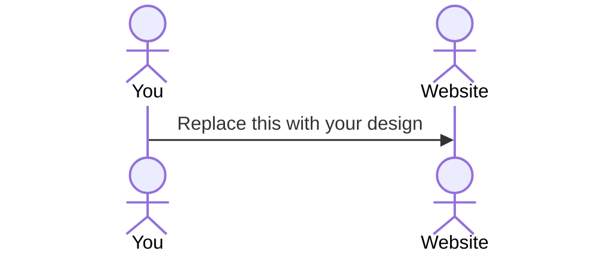

# Your startup name here

[My Notes](notes.md)

A brief description of the application here. I'm going to make a really cool startup, I'm just not quite sure yet what that is going to be yet.

> [!NOTE]
> If you are not familiar with Markdown then you should review the [documentation](https://docs.github.com/en/get-started/writing-on-github/getting-started-with-writing-and-formatting-on-github/basic-writing-and-formatting-syntax) before continuing.

## 🚀 Specification Deliverable

> [!NOTE]
> Fill in this sections as the submission artifact for this deliverable. You can refer to this [example](https://github.com/webprogramming260/startup-example/blob/main/README.md) for inspiration.

For this deliverable I did the following. I checked the box `[x]` and added a description for things I completed.

-   [ ] Proper use of Markdown
-   [ ] A concise and compelling elevator pitch
-   [ ] Description of key features
-   [ ] Description of how you will use each technology
-   [ ] One or more rough sketches of your application. Images must be embedded in this file using Markdown image references.

### Elevator pitch

It's important to remember. Remember past experiences, past conversations, past friends. Yet despite this, in our hustle and bustle, in our busy daily lives, we often don't have the time or don't make the effort record these small, important moments. But our homes can be small snapshots of our lives. That's where Drop A Memory comes in. Home owners post a QR code or url in their home, guiding guests to their personal Drop A Memory room. Visitors, on the way out, visit the website to leave a small description and living record of all the memories and experiences shared.

### Design

### Key features

-   Describe your key feature
-   Describe your key feature
-   Describe your key feature

### Technologies

I am going to use the required technologies in the following ways.

-   **HTML** - Description here
-   **CSS** - Description here
-   **React** - Description here
-   **Service** - Description here
-   **DB/Login** - Description here
-   **WebSocket** - Description here

## 🚀 AWS deliverable

For this deliverable I did the following. I checked the box `[x]` and added a description for things I completed.

-   [ ] **Server deployed and accessible with custom domain name** - [My server link](https://yourdomainnamehere.click).

## 🚀 HTML deliverable

For this deliverable I did the following. I checked the box `[x]` and added a description for things I completed.

-   [ ] **HTML pages** - I did not complete this part of the deliverable.
-   [ ] **Proper HTML element usage** - I did not complete this part of the deliverable.
-   [ ] **Links** - I did not complete this part of the deliverable.
-   [ ] **Text** - I did not complete this part of the deliverable.
-   [ ] **3rd party API placeholder** - I did not complete this part of the deliverable.
-   [ ] **Images** - I did not complete this part of the deliverable.
-   [ ] **Login placeholder** - I did not complete this part of the deliverable.
-   [ ] **DB data placeholder** - I did not complete this part of the deliverable.
-   [ ] **WebSocket placeholder** - I did not complete this part of the deliverable.

## 🚀 CSS deliverable

For this deliverable I did the following. I checked the box `[x]` and added a description for things I completed.

-   [ ] **Header, footer, and main content body** - I did not complete this part of the deliverable.
-   [ ] **Navigation elements** - I did not complete this part of the deliverable.
-   [ ] **Responsive to window resizing** - I did not complete this part of the deliverable.
-   [ ] **Application elements** - I did not complete this part of the deliverable.
-   [ ] **Application text content** - I did not complete this part of the deliverable.
-   [ ] **Application images** - I did not complete this part of the deliverable.

## 🚀 React part 1: Routing deliverable

For this deliverable I did the following. I checked the box `[x]` and added a description for things I completed.

-   [ ] **Bundled using Vite** - I did not complete this part of the deliverable.
-   [ ] **Components** - I did not complete this part of the deliverable.
-   [ ] **Router** - I did not complete this part of the deliverable.

## 🚀 React part 2: Reactivity deliverable

For this deliverable I did the following. I checked the box `[x]` and added a description for things I completed.

-   [ ] **All functionality implemented or mocked out** - I did not complete this part of the deliverable.
-   [ ] **Hooks** - I did not complete this part of the deliverable.

## 🚀 Service deliverable

For this deliverable I did the following. I checked the box `[x]` and added a description for things I completed.

-   [ ] **Node.js/Express HTTP service** - I did not complete this part of the deliverable.
-   [ ] **Static middleware for frontend** - I did not complete this part of the deliverable.
-   [ ] **Calls to third party endpoints** - I did not complete this part of the deliverable.
-   [ ] **Backend service endpoints** - I did not complete this part of the deliverable.
-   [ ] **Frontend calls service endpoints** - I did not complete this part of the deliverable.
-   [ ] **Supports registration, login, logout, and restricted endpoint** - I did not complete this part of the deliverable.

## 🚀 DB deliverable

For this deliverable I did the following. I checked the box `[x]` and added a description for things I completed.

-   [ ] **Stores data in MongoDB** - I did not complete this part of the deliverable.
-   [ ] **Stores credentials in MongoDB** - I did not complete this part of the deliverable.

## 🚀 WebSocket deliverable

For this deliverable I did the following. I checked the box `[x]` and added a description for things I completed.

-   [ ] **Backend listens for WebSocket connection** - I did not complete this part of the deliverable.
-   [ ] **Frontend makes WebSocket connection** - I did not complete this part of the deliverable.
-   [ ] **Data sent over WebSocket connection** - I did not complete this part of the deliverable.
-   [ ] **WebSocket data displayed** - I did not complete this part of the deliverable.
-   [ ] **Application is fully functional** - I did not complete this part of the deliverable.
